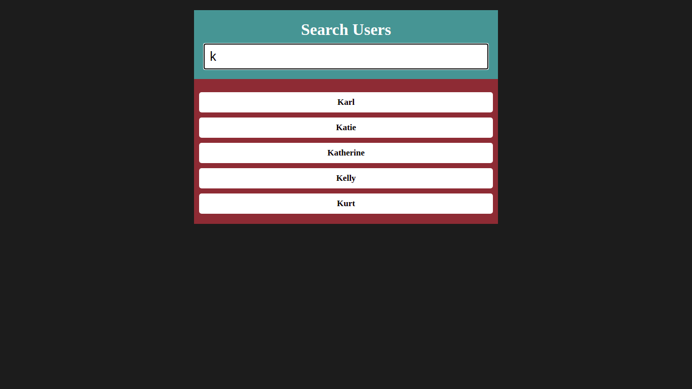

# Javascript Live Search

> It's a simple reusable search bar. In current logic, it's running for searching in an unordered list. You can easily change its logic if you want to live search on the current page for another element.

## Built With

- HTML, CSS, JavaScript

## Getting Started

To get a local copy up and running follow these simple example steps.

First you need to clone the repo. Then open index.html with your browser. Type sth in the search input.
    
## Authors

👤 **Emir Sağıt**

- GitHub: [@emirsagit](https://github.com/emirsagit)
- Twitter: [@emirsagit](https://twitter.com/emirsagit)
- LinkedIn: [Emir Sağıt](https://www.linkedin.com/in/emir-sa%C4%9F%C4%B1t-633035188/)

## 🤝 Contributing

Contributions, issues, and feature requests are welcome!

Feel free to check the [issues page](../../issues/).

## Show your support

Give a ⭐️ if you like this project!

## 📝 License

This project is [MIT](./MIT.md) licensed.
